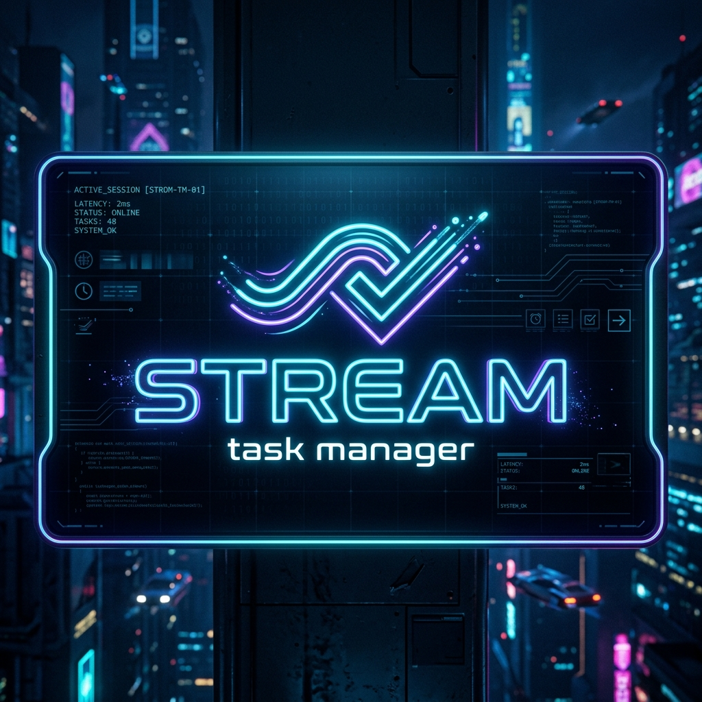
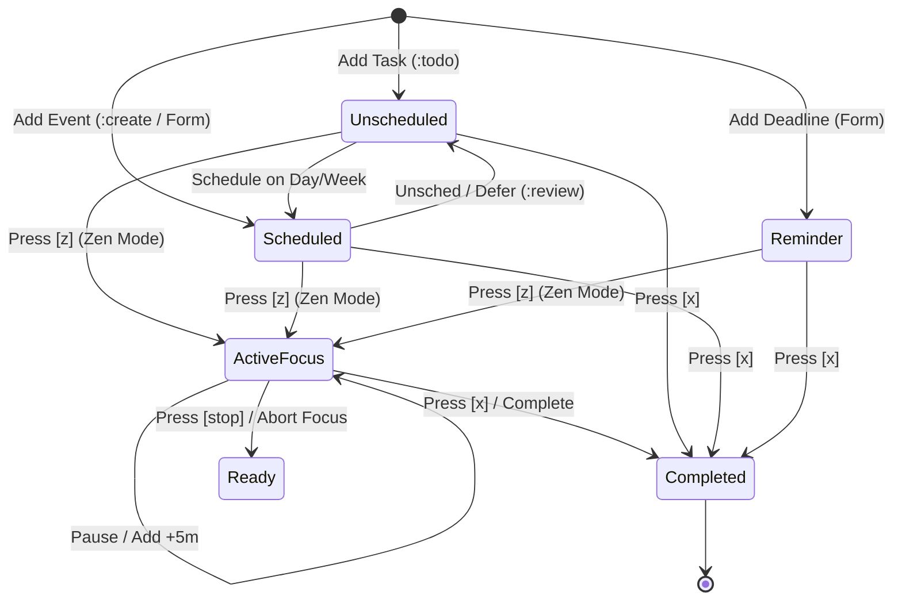
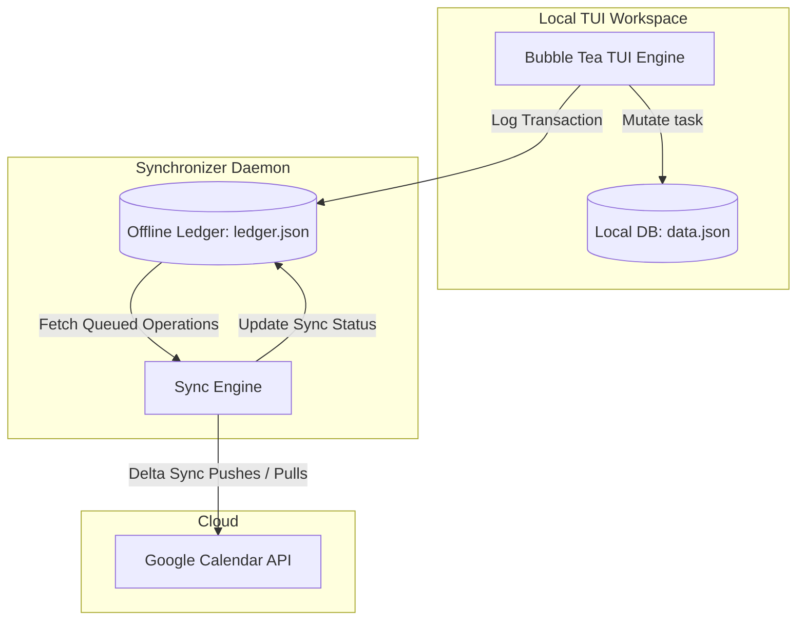

# 🌊 stream — VIM-First TUI Task Management & Calendar Engine

<p align="center">
  
</p>

<p align="center">
  
  
  
  
</p>

`stream` is an offline-first, terminal-native calendar and productivity engine. It bridges the gap between time-blocking and backlogs by treating calendar events as executable, stateful objects moving through a defined lifecycle. 

Designed for developers, sysadmins, and keyboard power-users who want VIM-style execution speed without sacrificing a rich, visually premium TUI interface.

---

## 🚀 Quick Start in 60 Seconds

Get up and running instantly:

```bash
# 1. Clone & Build
git clone https://github.com/mudoker/stream.git && cd stream
go build -ldflags="-s -w" -o stream

# 2. Run the TUI
./stream
```

---

## 📖 User Guide: The Daily Flow

`stream` matches your natural workflow, keeping your hands on the home row. Here is how to run your day:

```text
  CAPTURE             PLAN               FOCUS              REVIEW
┌─────────┐       ┌──────────┐       ┌──────────┐       ┌────────────┐
│  :todo  │ ───>  │ :create  │ ───>  │ Press z  │ ───>  │  :review   │
└─────────┘       └──────────┘       └──────────┘       └────────────┘
Backlog shelf     Timeblock view     Pomodoro mode      Daily shutdown
```

### 1. 📂 Separate Your Focus (Workspaces)
Keep life organized. Create separate profiles for work or personal life:
* Run `:ws-create` to make a workspace (e.g., `💼 Engineering`).
* Run `:ws-switch` to pick or swap between them.

### 2. 📝 Capture & Schedule
* **Fast Backlog**: Type `:todo <title>` to instantly add an unscheduled task to your **Todo Shelf**.
* **Quick Block**: Type `:create <title>` to schedule a task for today at 9:00 AM.
* **Precision Planning**: Press <kbd>i</kbd> to open the Wizard form and define priority, duration, and workspaces.

### 3. 🧭 Navigate the Perspective Views
Switch views instantly to suit your focus level:
* <kbd>1</kbd> **Dashboard** • <kbd>2</kbd> **Month Grid** • <kbd>3</kbd> **Week Columns** • <kbd>4</kbd> **Day Timeline** • <kbd>5</kbd> **Analytics**
* Use <kbd>j</kbd>/<kbd>k</kbd> to move vertically between items, and <kbd>Tab</kbd> to switch focus panels (Sidebar ⟷ Calendar ⟷ Todo Shelf).

### 4. 🧘 Run Your Focus (Zen Mode)
* Hover over any task on your timeline and press <kbd>z</kbd> to initiate a focus Pomodoro.
* Need more time? Hit <kbd>+</kbd> to inject 5 minutes.
* Got distracted? Log interruptions to calculate your focus quality.
* Press <kbd>Esc</kbd> to hide the TUI; the timer keeps running in the background.

### 5. 🌅 Reflect (Daily Shutdown)
* Before you log off, run `:review` to review your day.
* It calculates focus time, completed items, and lists deferred items, ensuring you start tomorrow with a clean slate.

---

## 🗃️ Task Taxonomy

| Type | Badge | Description | Target View | Story Points |
| :--- | :---: | :--- | :--- | :---: |
| **Anchored** | <span style="background:#4A90E2;color:white;padding:2px 8px;border-radius:4px;font-size:11px;font-weight:bold;">ANCHORED</span> | Fixed scheduled events with set Start Time & Duration. | Day/Week/Month | 🟢 Yes |
| **Floating** | <span style="background:#50E3C2;color:black;padding:2px 8px;border-radius:4px;font-size:11px;font-weight:bold;">FLOATING</span> | Classic backlogs or "to-do" items with no time constraint. | Todo Shelf | 🟢 Yes |
| **Reminder** | <span style="background:#F5A623;color:white;padding:2px 8px;border-radius:4px;font-size:11px;font-weight:bold;">REMINDER</span> | High-level deadlines with a due date & optional time. | Todo Shelf | ❌ No |
| **Habit** | <span style="background:#B8E986;color:black;padding:2px 8px;border-radius:4px;font-size:11px;font-weight:bold;">HABIT</span> | Daily routines that keep repeating. | Dashboard | ❌ No |

---

## ⌨️ TUI Keyboard Controls & Commands

<details>
<summary>⌨️ Expand Keyboard Controls Cheat Sheet</summary>

### Navigation & Actions (Normal Mode)
* <kbd>1</kbd> – <kbd>5</kbd> : Switch views (Dashboard ➜ Month ➜ Week ➜ Day ➜ Analytics)
* <kbd>j</kbd> / <kbd>k</kbd> : Navigate selected task vertically
* <kbd>h</kbd> / <kbd>l</kbd> : Navigate overlapping tasks horizontally
* <kbd>J</kbd> / <kbd>K</kbd> : Scroll timeline hours up / down
* <kbd>H</kbd> / <kbd>L</kbd> : Switch days backward / forward
* <kbd>t</kbd> : Jump back to today
* <kbd>w</kbd> / <kbd>W</kbd> : Cycle next / previous workspace
* <kbd>Tab</kbd> : Toggle focus (Sidebar ⟷ Day Timeline ⟷ Todo Shelf)
* <kbd>i</kbd> : Open Task Creation Wizard
* <kbd>z</kbd> : Start / Resume Zen Focus Timer
* <kbd>Enter</kbd> : Slide out Detailed Task Inspector
* <kbd>e</kbd> : Edit Task (from Detail Inspector)
* <kbd>x</kbd> : Complete Selected Task
* <kbd>d</kbd> : Delete Selected Task
* <kbd>:</kbd> : Open Command Palette

### Wizard Mode (Form Filling)
* <kbd>Tab</kbd> / <kbd>Down</kbd> : Move to next field
* <kbd>Shift+Tab</kbd> / <kbd>Up</kbd> : Move to previous field
* <kbd>Left</kbd> / <kbd>Right</kbd> : Cycle dropdown choices
* <kbd>Enter</kbd> : Submit / Advance field
* <kbd>Esc</kbd> : Dismiss Wizard

### Zen Mode (Timer)
* <kbd>Space</kbd> : Pause / Resume timer
* <kbd>+</kbd> : Inject +5 minutes to active focus
* <kbd>b</kbd> : Skip current block
* <kbd>Esc</kbd> : Background the timer and return to TUI
</details>

<details>
<summary>💬 Expand Command Palette Reference (<code>:</code>)</summary>

* `:create <title>` — Quick-schedule a task for today at 9:00 AM.
* `:todo <title>` — Add an unscheduled floating task to the Todo Shelf.
* `:habit <title>` — Create a daily repeatable habit.
* `:ws-switch` — Open the visual workspace selector modal.
* `:ws-switch <name>` — Switch directly to the named workspace.
* `:ws-create` — Open form to create a workspace.
* `:ws-edit` — Edit the active workspace's icon, badge, and name.
* `:ws-delete [name]` — Delete the specified (or active) workspace.
* `:review` — Start the Daily Shutdown Review.
* `:pull` / `:push` — Trigger manual Google Calendar sync.
* `:sync-settings` — Set sync mode (Two-Way/Push/None) and intervals.
* `:auth` — Launch authorization web helper callback server.
* `:stop` — Halt focus timer and save metrics.
* `:q` / `:quit` — Safely exit `stream`.
</details>

---

## ⚙️ Architecture & Configurations

<details>
<summary>🗺️ Executable Task Lifecycle State Machine</summary>


</details>

<details>
<summary>🔄 Offline-First Google Calendar Sync Architecture</summary>

`stream` operates fully offline. Your scheduling flow is never bottlenecked by network timeouts. A standalone local transaction ledger commits updates to disk immediately and synchronizes them asynchronously with Google Calendar.



### Google Calendar Setup
1. Create a project on the [Google Cloud Console](https://console.cloud.google.com/).
2. Enable the **Google Calendar API**.
3. Create desktop client OAuth credentials, download the JSON secrets file, and rename it to `~/.config/stream/client_secrets.json`.
4. Run `stream`, type `:auth` and press <kbd>Enter</kbd>.
5. Complete authorization in your browser window to populate `credentials.json`.
</details>

<details>
<summary>📂 Configuration Directory & JSON Database Models</summary>

All local configuration, credentials, and ledger database states reside in `~/.config/stream/`.

```text
~/.config/stream/
├── client_secrets.json     # User downloaded GCal Client Credentials
├── credentials.json        # active OAuth Refresh/Access Tokens
├── workspaces.json         # Workspace register index & active settings
├── ledger.json             # Sync queue containing unsynced local deltas
└── data.json               # Primary Local task database
```

### 📄 Sample Task Model (`data.json`)
```json
{
  "uuid": "4c94de3a-cf3d-4952-b883-71869e5d4cb0",
  "workspace_uuid": "e81d77a2-f94d-4591-9fa6-27a9cfd7b219",
  "title": "Clean codebase database layers",
  "description": "Remove legacy database functions and refactor views",
  "priority": "P1",
  "story_points": 5,
  "scheduling_type": "Anchored",
  "lifecycle_state": "Scheduled",
  "time_window": {
    "start": "2026-06-11T09:00:00+07:00",
    "end": "2026-06-11T10:30:00+07:00"
  },
  "tags": ["engineering", "refactor"],
  "execution_metrics": {
    "elapsed_focus_seconds": 3600,
    "elapsed_break_seconds": 600,
    "interruption_count": 1
  }
}
```

### 📄 Sample Workspace Model (`workspaces.json`)
```json
{
  "active_workspace_uuid": "e81d77a2-f94d-4591-9fa6-27a9cfd7b219",
  "workspaces": [
    {
      "uuid": "e81d77a2-f94d-4591-9fa6-27a9cfd7b219",
      "name": "Engineering Workspace",
      "icon": "🚀",
      "badge": "Eng"
    },
    {
      "uuid": "d1a89c92-3a5f-4d66-8f2c-59df11c81ef4",
      "name": "Personal Goals",
      "icon": "🏠",
      "badge": "Life"
    }
  ]
}
```
</details>
