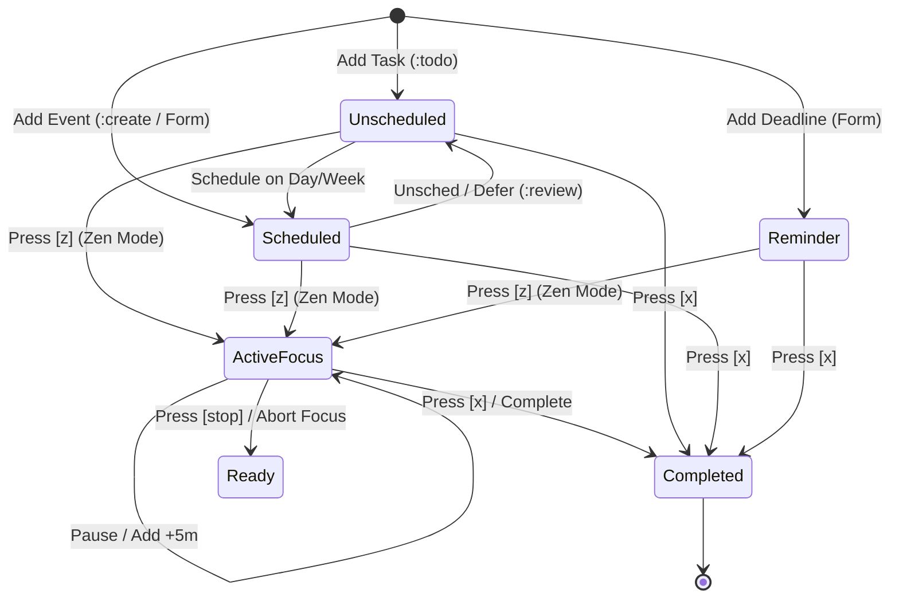
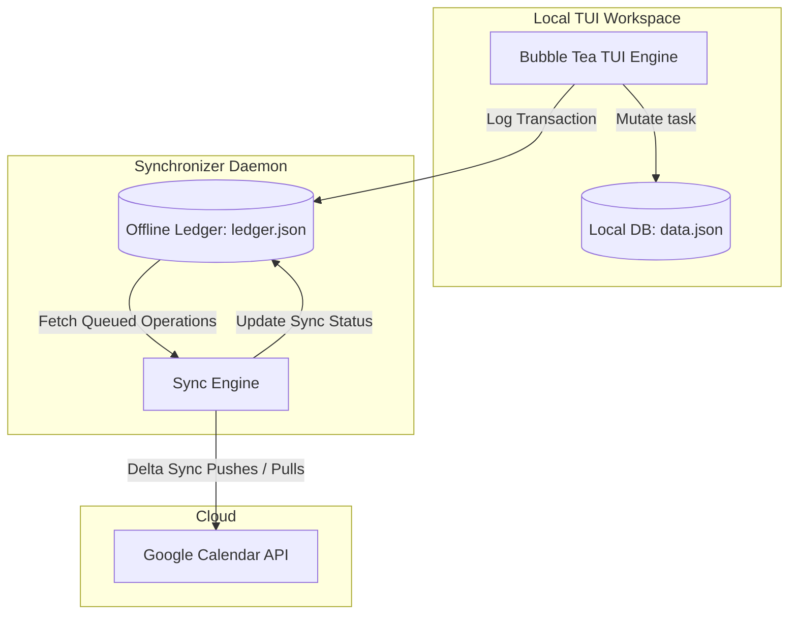

# 🌊 stream — VIM-First TUI Task Management & Calendar Engine

<p align="center">
  
</p>

<p align="center">
  
  
  
  
</p>

<p align="center">
  
</p>

`stream` is an offline-first, terminal-native calendar and productivity engine. It bridges the gap between time-blocking and backlogs by treating calendar events as executable, stateful objects moving through a defined lifecycle. 

Designed for developers, sysadmins, and keyboard power-users who want VIM-style execution speed without sacrificing a rich, visually premium TUI interface.

---

## 🗺️ Executable Task Lifecycle

`stream` models your tasks as moving parts of an active engine. Here is how tasks transition through different states in the system:



---

## 🔄 Sync Architecture (Offline-First)

`stream` operates fully offline. Your scheduling flow is never bottlenecked by network timeouts. A standalone local transaction ledger commits updates to disk immediately and synchronizes them asynchronously with Google Calendar.



---

## 🗃️ Task Taxonomy

`stream` supports four task types, customized to keep your schedules distinct and clean.

| Badge | Type | Intent | Target View | Story Points |
| :---: | :--- | :--- | :--- | :---: |
| <span style="background:#4A90E2;color:white;padding:2px 8px;border-radius:4px;font-size:11px;font-weight:bold;">ANCHORED</span> | **Anchored Tasks** | Fixed scheduled events with set Start Time & Duration. | Day/Week/Month | 🟢 Yes |
| <span style="background:#50E3C2;color:black;padding:2px 8px;border-radius:4px;font-size:11px;font-weight:bold;">FLOATING</span> | **Floating Tasks** | Classic backlogs or "to-do" items with no time constraint. | Todo Shelf | 🟢 Yes |
| <span style="background:#F5A623;color:white;padding:2px 8px;border-radius:4px;font-size:11px;font-weight:bold;">REMINDER</span> | **Reminders** | High-level deadlines with a due date & **optional** due time. | Todo Shelf | ❌ No |
| <span style="background:#B8E986;color:black;padding:2px 8px;border-radius:4px;font-size:11px;font-weight:bold;">HABIT</span> | **Habits** | Daily routines that keep repeating. | Dashboard | ❌ No (0 SP) |

> [!TIP]
> **Sentinel Time Logic for Optional Due Times**:
> When a **Reminder** is created without a due time, `stream` sets the `Start` timestamp's second component to `1` (e.g. `HH:MM:01`). The UI parses this sentinel value to omit the time stamp on all dashboards, lists, and detail modals. If a due time is specified, the second component is set to `0`.

---

## 🌟 Key Features

### 📅 Multi-Perspective Views
Switch views instantly using keyboard keys <kbd>1</kbd> through <kbd>5</kbd>:
* 🖥️ **`1` Dashboard**: Your command center. Highlights today's focused task, upcoming calendar events, active habits, and reminders.
* 🗓️ **`2` Month Grid**: A clean calendar overview showing daily task densities.
* 📊 **`3` Week Columns**: A vertical multi-day timeline showing scheduled timeblocks proportionally.
* 🕒 **`4` Day Timeline**: A rich 24-hour vertical timeline mapping overlapping tasks and slots.
* 📈 **`5` Analytics**: Visual insights on focus hours logged, focus-to-rest efficiency, and distraction counts.

### 🧘 Zen Focus Engine
Launch an immersive focus workspace directly from any task with <kbd>z</kbd>:
* **Pomodoro-style cycles**: Alternate between focus blocks and rest blocks.
* **On-the-fly micro adjustments**: Inject <kbd>+</kbd> 5 minutes or press <kbd>b</kbd> to skip the current block.
* **Distraction Logging**: Keep track of interruptions to compute an end-of-session **Focus Quality Score**.
* **Background Timer**: Escape with <kbd>Esc</kbd> to browse; the timer runs in the background.

### 🔄 Offline-First Google Calendar Sync
* Bidirectional synchronization built on top of a local transaction ledger (`ledger.json`).
* If sync fails due to internet issues, the TUI never blocks; transactions are processed asynchronously once you reconnect.
* Flexible modes: **Two-Way Sync** or **Push-Only** setup.

### 💼 Workspaces & Profiles
* **Workspaces**: Separate your life (e.g., `💼 Work`, `🏠 Personal`) with custom icons and badges.
* **Profiles**: Lock the TUI screen after a period of idle inactivity with timeout and password protection.

---

## ⌨️ TUI Keyboard Controls

### Normal Mode (Navigation)
| Key | Action |
| :---: | :--- |
| <kbd>1</kbd> – <kbd>5</kbd> | Switch views |
| <kbd>j</kbd> / <kbd>k</kbd> | Navigate selected task vertically |
| <kbd>h</kbd> / <kbd>l</kbd> | Navigate overlapping tasks horizontally |
| <kbd>J</kbd> / <kbd>K</kbd> | Scroll timeline hours up / down |
| <kbd>H</kbd> / <kbd>L</kbd> | Switch days backward / forward |
| <kbd>t</kbd> | Jump back to today |
| <kbd>w</kbd> / <kbd>W</kbd> | Cycle next / previous workspace |
| <kbd>Tab</kbd> | Toggle focus (Sidebar ⟷ Day Timeline ⟷ Todo Shelf) |
| <kbd>i</kbd> | Open Task Creation Wizard |
| <kbd>z</kbd> | Start / Resume Zen Focus Timer |
| <kbd>Enter</kbd> | Slide out Detailed Task Inspector |
| <kbd>e</kbd> | Edit Task (from Detail Inspector) |
| <kbd>x</kbd> | Complete Selected Task |
| <kbd>d</kbd> | Delete Selected Task (asks confirmation) |
| <kbd>:</kbd> | Open Command Palette |

### Wizard Mode (Form Filling)
* <kbd>Tab</kbd> / <kbd>Down</kbd> — Move to next input field
* <kbd>Shift</kbd> + <kbd>Tab</kbd> / <kbd>Up</kbd> — Move to previous input field
* <kbd>Left</kbd> / <kbd>Right</kbd> / <kbd>Space</kbd> — Cycle dropdown choices (Priority, Type)
* <kbd>Enter</kbd> — Submit or advance field
* <kbd>Esc</kbd> — Dismiss Wizard

### Zen Mode (Timer)
* <kbd>Space</kbd> — Pause / Resume countdown timer
* <kbd>+</kbd> — Inject +5 minutes to active focus block
* <kbd>b</kbd> — Skip current block
* <kbd>Esc</kbd> — Return to Main TUI (timer continues in background)

---

## 💬 Command Palette (`:`)

Type <kbd>:</kbd> in Normal Mode to open the interactive command palette with completion:

* `:create <title>` — Quick-schedule a task for today at 9:00 AM.
* `:todo <title>` — Add an unscheduled floating task to the Todo Shelf.
* `:habit <title>` — Create a daily repeatable habit.
* `:ws-switch` — Open the visual workspace selector modal.
* `:ws-switch <name>` — Switch directly to the named workspace.
* `:ws-create` — Open form to create a workspace.
* `:ws-edit` — Edit the active workspace's icon, badge, and name.
* `:ws-delete [name]` — Delete the specified (or active) workspace.
* `:review` — Start the Daily Shutdown Review.
* `:pull` / `:push` — Trigger manual Google Calendar sync.
* `:sync-settings` — Set sync mode (Two-Way/Push/None) and intervals.
* `:auth` — Launch authorization web helper callback server.
* `:stop` — Halt focus timer and save metrics.
* `:q` / `:quit` — Safely exit `stream`.

---

## ⚙️ Configuration & JSON Models

All local configuration, credentials, and ledger database states reside in `~/.config/stream/`.

### 📂 Config Directory Tree
```text
~/.config/stream/
├── client_secrets.json     # User downloaded GCal Client Credentials
├── credentials.json        # active OAuth Refresh/Access Tokens
├── workspaces.json         # Workspace register index & active settings
├── ledger.json             # Sync queue containing unsynced local deltas
└── data.json               # Primary Local task database
```

### 📄 Sample Task Model (`data.json`)
```json
{
  "uuid": "4c94de3a-cf3d-4952-b883-71869e5d4cb0",
  "workspace_uuid": "e81d77a2-f94d-4591-9fa6-27a9cfd7b219",
  "title": "Clean codebase database layers",
  "description": "Remove legacy database functions and refactor views",
  "priority": "P1",
  "story_points": 5,
  "scheduling_type": "Anchored",
  "lifecycle_state": "Scheduled",
  "time_window": {
    "start": "2026-06-11T09:00:00+07:00",
    "end": "2026-06-11T10:30:00+07:00"
  },
  "tags": ["engineering", "refactor"],
  "execution_metrics": {
    "elapsed_focus_seconds": 3600,
    "elapsed_break_seconds": 600,
    "interruption_count": 1
  }
}
```

### 📄 Sample Workspace Model (`workspaces.json`)
```json
{
  "active_workspace_uuid": "e81d77a2-f94d-4591-9fa6-27a9cfd7b219",
  "workspaces": [
    {
      "uuid": "e81d77a2-f94d-4591-9fa6-27a9cfd7b219",
      "name": "Engineering Workspace",
      "icon": "🚀",
      "badge": "Eng"
    },
    {
      "uuid": "d1a89c92-3a5f-4d66-8f2c-59df11c81ef4",
      "name": "Personal Goals",
      "icon": "🏠",
      "badge": "Life"
    }
  ]
}
```

---

## 🚀 Build & Setup Guide

### 1. Build and Run
```bash
# Clone the repository
git clone https://github.com/mudoker/stream.git
cd stream

# Build optimized binary
go build -ldflags="-s -w" -o stream

# Install to path
mv stream ~/.local/bin/
```

### 2. Run Tests
```bash
go test ./...
```

### 3. Google Calendar Sync Setup
1. Create a project on the Google Cloud Console.
2. Enable the **Google Calendar API**.
3. Create desktop client OAuth credentials, download the JSON secrets file, and rename it to `~/.config/stream/client_secrets.json`.
4. Run `stream`, type `:auth` and press <kbd>Enter</kbd>.
5. Complete authorization in your browser window to populate `credentials.json`.
