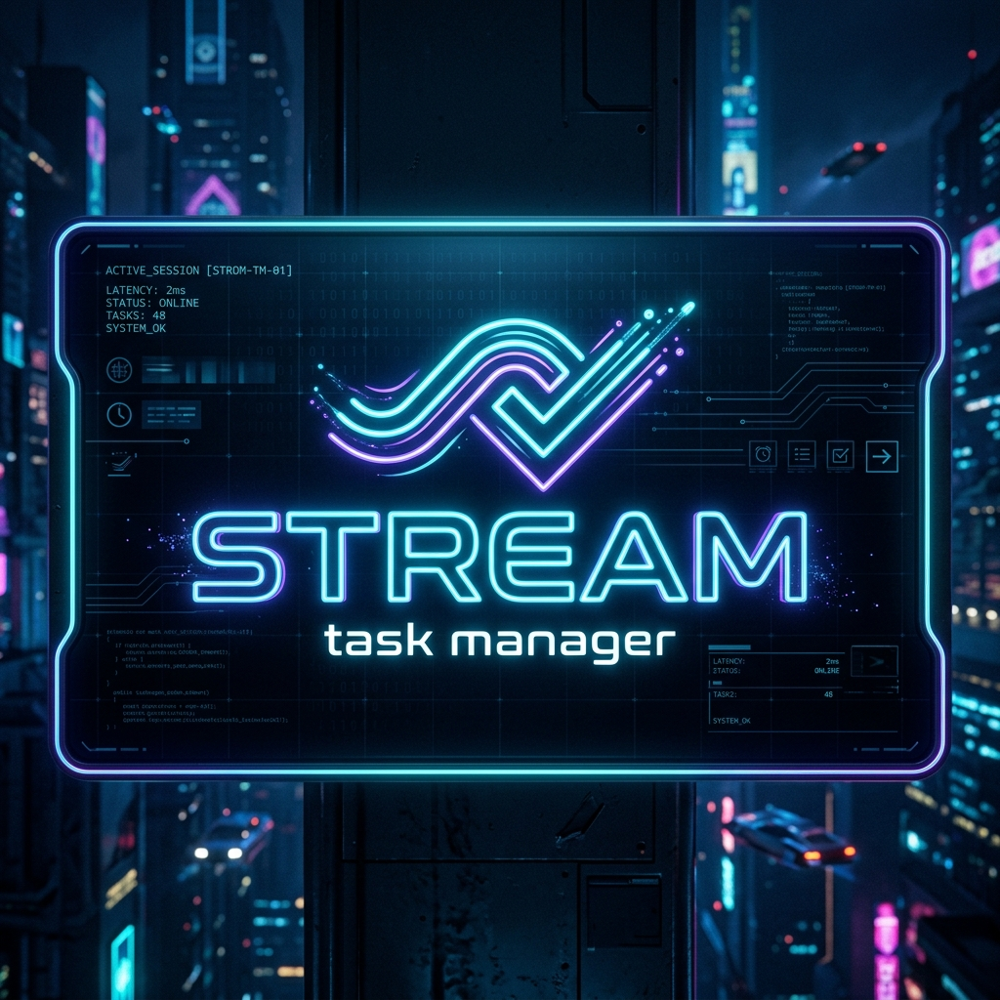
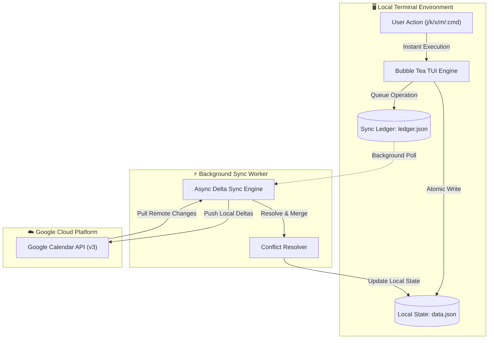

<div align="center">



# 🌊 stream

### *The High-Performance, VIM-First TUI Calendar & Agile Productivity Engine*

[](https://golang.org)
[](https://github.com/charmbracelet/bubbletea)
[](https://github.com/charmbracelet/lipgloss)
[](https://github.com/mudoker/stream)
[](https://developers.google.com/calendar)
[](https://github.com/mudoker/stream/releases)
[](LICENSE)

<br/>

<p align="center">
  <b>Tired of heavy, mouse-driven web productivity apps?</b><br/>
  <code>stream</code> bridges the gap between deep time-blocking, backlog triage, and agile sprint planning — directly inside your terminal with pure home-row VIM ergonomics.
</p>

---

[🚀 Quick Start](#-quick-start-in-60-seconds) •
[✨ Core Highlights](#-core-highlights) •
[🧭 6 Perspective Views](#-the-6-perspective-views) •
[🏃 Daily Workflow](#-the-daily-flow) •
[🎷 Jazz Lounge & Zen Mode](#-zen-focus-mode--the-jazz-lounge) •
[🗃️ Work Item Taxonomy](#-work-item-taxonomy--agile-engine) •
[🔄 Sync Architecture](#-offline-first-sync-architecture) •
[⌨️ Shortcuts & Commands](#️-keyboard-shortcuts--command-palette) •
[⚙️ Configuration](#-configuration--models)

---

</div>

<br/>

## ✨ Core Highlights

- ⌨️ **Vim-First Ergonomics**: Total keyboard navigation (`h`/`j`/`k`/`l`, `w`/`W`, `t`, `ctrl+d`/`ctrl+u`, command palette `:`) designed to keep your hands glued to the home row.
- ⚡ **6 Unified Perspectives**: Seamlessly toggle between **Dashboard**, **Month Grid**, **Sprint Kanban**, **Week Matrix**, **Day Timeline**, and **Deep Work Analytics**.
- 📋 **Agile Sprint Engine**: Built-in Kanban swimlanes (`Backlog` ➔ `In Progress` ➔ `Testing` ➔ `Done`), story points velocity, issue hierarchy (`Features`, `Defects`, `Improvements`, `Tasks`), and linked blocker badges.
- 🧘 **Zen Focus Mode & Interruption Tracker**: Pomodoro & stopwatch timer with real-time progress bars, `+5m` focus injections, interruption logging, and deep work metrics.
- 🎷 **Procedural Jazz Lounge & Ambient Audio**: Generative procedural jazz chord progressions and multi-channel soundscapes (*Rain*, *Thunder*, *Campfire*, *Server Room*, *Lo-Fi loops*) generated natively without leaving the terminal.
- 🔄 **Offline-First Google Calendar 2-Way Sync**: Instant local mutation ledger (`ledger.json`) with background asynchronous delta sync and OAuth2 browser handshake. Zero UI latency even on poor connections.
- 📂 **Multi-Context Workspaces**: Isolate personal goals, engineering sprints, and consulting clients with instant hot-swapping (`w`/`W` or `:ws-switch`).
- 🌅 **Daily Shutdown Ritual**: Guided review system (`:review`) that tallies completed story points, focus ratios, and safely carries over undone floating tasks for a clean slate tomorrow.

---

## 🚀 Quick Start in 60 Seconds

### Installation

```bash
# 1. Clone the repository
git clone https://github.com/mudoker/stream.git
cd stream

# 2. Build the optimized binary
go build -ldflags="-s -w" -o stream

# 3. Launch stream
./stream
```

> [!TIP]
> Add `stream` to your `$PATH` (e.g. `cp ./stream /usr/local/bin/`) to launch your schedule instantly from any terminal window.

---

## 🧭 The 6 Perspective Views

Switch between 6 dedicated views instantly with keys <kbd>1</kbd> through <kbd>6</kbd>:

```text
 ┌───┐ ┌───┐ ┌───┐ ┌───┐ ┌───┐ ┌───┐
 │ 1 │ │ 2 │ │ 3 │ │ 4 │ │ 5 │ │ 6 │
 └───┘ └───┘ └───┘ └───┘ └───┘ └───┘
Dash   Month  Sprint  Week   Day   Stats
```

| Key | View Name | Description | Key Capabilities |
| :---: | :--- | :--- | :--- |
| <kbd>1</kbd> | **Dashboard** | Unified mission control center | Daily agenda, capacity gauge, quick backlog glance, upcoming deadlines, habit tracking streaks |
| <kbd>2</kbd> | **Month Grid** | High-level macroscopic calendar | Multi-month infinite scrolling, day-level task density heat indicators, rapid date navigation |
| <kbd>3</kbd> | **Sprint Board** | Agile Kanban & backlog manager | Multi-sprint management, swimlane triage, story points velocity, Global Backlog drawer |
| <kbd>4</kbd> | **Week Matrix** | 7-day visual time-blocking grid | Overlapping event layout engine, weekly capacity visualization, scheduled work distribution |
| <kbd>5</kbd> | **Day Timeline** | Precision hourly execution view | Hour-by-hour time-blocking, floating **Todo Shelf**, commute blocks, interactive rescheduling (`m`) |
| <kbd>6</kbd> | **Analytics** | Deep work telemetry & habits | Focus vs. break ratios, daily focus heatmaps, interruption frequency, flow quality score |

---

## 🏃 The Daily Flow

`stream` matches your natural cognitive rhythm throughout the day:

```text
     09:00 AM                  10:00 AM                 12:00 PM                 06:00 PM
  ┌────────────┐            ┌────────────┐           ┌────────────┐           ┌────────────┐
  │  CAPTURE   │  ───────>  │  SCHEDULE  │  ──────>  │ DEEP FOCUS │  ──────>  │  SHUTDOWN  │
  └────────────┘            └────────────┘           └────────────┘           └────────────┘
   :todo / :task             :create / i              Press [z]                :review
   Dump thoughts to          Time-block on            Pomodoro + Jazz          Reflect & carry
   Todo Shelf                Day timeline             ambient lounge           over clean slate
```

### 1. 📥 Rapid Capture (Inbox Zero)
- Fast-dump floating tasks to your shelf: `:todo Refactor database query engine`
- Create sprint work items: `:feature User authentication v2` or `:defect Fix race condition in sync`
- Open the rich Task Wizard: press <kbd>i</kbd>

### 2. 🗓️ Precision Time-Blocking
- Schedule an anchored slot for 9:00 AM: `:create Team standup & sprint sync`
- Reschedule or shift tasks interactively on the timeline: press <kbd>m</kbd>
- Toggle focus between the timeline and Todo Shelf: press <kbd>Tab</kbd>

### 3. 🧘 Execute in the Flow Zone
- Highlight any task and hit <kbd>z</kbd> to launch **Zen Focus Mode**.
- Open the **Jazz Lounge** (`:music`) to play generative procedural chord progressions mixed with soothing rain or campfire audio.
- Hit <kbd>+</kbd> to inject 5 extra minutes when in the zone, or log interruptions to audit your focus purity.

### 4. 🌅 Daily Shutdown & Reflection
- Run `:review` at the end of the day.
- View total focus duration, completed vs deferred items, and clean up deferred tasks without guilt. Undone floating tasks automatically carry over to the next day's shelf.

---

## 🎷 Zen Focus Mode & The Jazz Lounge

### 🍅 Zen Mode (Focus Engine)
Press <kbd>z</kbd> on any task to enter the focused fullscreen HUD:

```text
┌─────────────────────────────────────────────────────────────┐
│  🧘 FOCUS SESSION: Refactor Authentication Middleware       │
│                                                             │
│  [████████████████████░░░░░░░░░░] 21:45 / 25:00 (87%)       │
│                                                             │
│  🔥 Interruption Count: 0        🎯 Current Block: 1 of 4   │
│  [Space] Pause   [+] Add 5m   [b] Break   [Esc] Background  │
└─────────────────────────────────────────────────────────────┘
```

- **Background Persistence**: Press <kbd>Esc</kbd> anytime — the timer continues running in the background while you navigate the TUI.
- **Interruption Auditing**: Record external distractions to measure your true focus ratio in **Analytics** (<kbd>6</kbd>).

### 🎷 The Procedural Jazz Lounge
Type `:music` in the command palette to launch the built-in ambient audio mixer:

- 🎹 **Procedural Chord Generation**: Algorithmic jazz progressions with selectable keys, smooth piano voicings, trumpet/sax lead riffs, and swing drum rhythms.
- 🌧️ **Layered Ambient Soundscapes**: Independent volume controls for **Rain**, **Thunder**, **Campfire**, and **Jungle**.
- 🎧 **Background Lo-Fi Loops**: Wind, Ocean Waves, Night Forest, Office Ambience, City Rain, Server Room Drone, Night Train, and Underwater acoustics.

---

## 🗃️ Work Item Taxonomy & Agile Engine

`stream` supports a structured two-tier hierarchy separating high-level deliverables from executable daily tasks:

```text
┌───────────────────────────────────────────────────────────────────┐
│ SPRINT / GLOBAL BACKLOG (Feature-Level Deliverables)               │
│                                                                   │
│   🏷️ [FEAT-1] OAuth2 Social Logins         🏷️ [DEF-4] Memory Leak │
│   🏷️ [IMP-2] Faster JSON Serialization                            │
└─────────────────┬─────────────────────────────────────────────────┘
                  │ decomposes into
                  ▼
┌───────────────────────────────────────────────────────────────────┐
│ EXECUTION LAYER (Day Timeline & Todo Shelf)                       │
│                                                                   │
│   ⏱️ [ANCHORED] 09:00 - 10:30 Team Sprint Planning                │
│   📋 [FLOATING] TSK-10: Write unit tests for Google OAuth         │
│   🔔 [REMINDER] Submit weekly timesheet by 17:00                  │
│   🔄 [HABIT]    Morning stretch & hydration streak                │
└───────────────────────────────────────────────────────────────────┘
```

### Classification Breakdown

| Work Item Type | Prefix / Badge | Scope & Placement | Time Constraints | Story Points |
| :--- | :---: | :--- | :--- | :---: |
| **Feature** | `FEAT-` | Sprint Swimlanes & Global Backlog | Milestone-driven | 🟢 1 - 13 pts |
| **Defect** | `DEF-` | Sprint Swimlanes & Global Backlog | Bug resolution | 🟢 1 - 8 pts |
| **Improvement**| `IMP-` | Sprint Swimlanes & Global Backlog | Refactor / optimization | 🟢 1 - 8 pts |
| **Task (Anchored)** | `TSK-` | Day / Week / Month Timeline | Fixed Start Time + Duration | 🟢 Optional |
| **Task (Floating)** | `TSK-` | Day View **Todo Shelf** / Backlog | Carries over until done | 🟢 Optional |
| **Reminder** | `REMINDER` | Todo Shelf & Upcoming Agenda | Due Date / High-priority alert | ❌ None |
| **Habit** | `HABIT` | Dashboard & Daily Habits Checklist | Recurring daily streak | ❌ None |

---

## 🔄 Offline-First Sync Architecture

`stream` guarantees zero latency. Every task update, sprint transition, or time-block modification is immediately committed to local persistent storage and logged to a transactional delta ledger. 


```mermaid
flowchart TD
    subgraph Local_TUI ["🖥️ Local Terminal Environment"]
        User["User Action (j/k/x/m/:cmd)"]
        TUI["Bubble Tea TUI Engine"]
        DB[("Local State: data.json")]
        Ledger[("Sync Ledger: ledger.json")]
    end

    subgraph Sync_Daemon ["⚡ Background Sync Worker"]
        Worker["Async Delta Sync Engine"]
        Conflict["Conflict Resolver"]
    end

    subgraph Cloud ["☁️ Google Cloud Platform"]
        GCal["Google Calendar API (v3)"]
    end

    User -->|Instant Execution| TUI
    TUI -->|Atomic Write| DB
    TUI -->|Queue Operation| Ledger
    Ledger -.->|Background Poll| Worker
    Worker -->|Push Local Deltas| GCal
    GCal -->|Pull Remote Changes| Worker
    Worker -->|Resolve & Merge| Conflict
    Conflict -->|Update Local State| DB
```

### Google Calendar Setup
1. Create a Google Cloud project on the [Google Cloud Console](https://console.cloud.google.com/).
2. Enable the **Google Calendar API**.
3. Create OAuth 2.0 Desktop Client credentials and save the credentials JSON to:
   ```bash
   ~/.config/stream/client_secrets.json
   ```
4. Run `stream`, type `:auth` and press <kbd>Enter</kbd>.
5. Follow the browser link to authorize your Google Calendar account. Once complete, two-way sync runs automatically in the background.

---

## ⌨️ Keyboard Shortcuts & Command Palette

### 🕹️ Normal Mode Navigation

| Keybinding | Action |
| :--- | :--- |
| <kbd>1</kbd> – <kbd>6</kbd> | Switch Perspective Views (`Dashboard`, `Month`, `Sprint`, `Week`, `Day`, `Analytics`) |
| <kbd>j</kbd> / <kbd>k</kbd> | Navigate selected task / card vertically |
| <kbd>h</kbd> / <kbd>l</kbd> | Navigate across Sprint swimlanes or overlapping time slots |
| <kbd>J</kbd> / <kbd>K</kbd> | Scroll timeline hours up / down |
| <kbd>H</kbd> / <kbd>L</kbd> | Step backward / forward one day |
| <kbd>t</kbd> | Jump immediately to Today |
| <kbd>Tab</kbd> | Cycle active panel focus (Sidebar ⟷ Main Canvas ⟷ Todo Shelf) |
| <kbd>w</kbd> / <kbd>W</kbd> | Cycle next / previous Workspace |
| <kbd>ctrl+d</kbd> / <kbd>ctrl+u</kbd> | Half-page fast scroll down / up |
| <kbd>i</kbd> | Open the Interactive Task Creation Wizard |
| <kbd>z</kbd> | Start / Resume Zen Focus Timer on selected task |
| <kbd>x</kbd> | Toggle task completion state |
| <kbd>m</kbd> | Enter Interactive Move / Reschedule mode (Day View) |
| <kbd>Enter</kbd> | Slide out Detailed Task Inspector modal |
| <kbd>e</kbd> | Edit task from the Task Inspector |
| <kbd>d</kbd> | Delete selected task (with confirmation prompt) |
| <kbd>?</kbd> | Open interactive help cheat sheet |
| <kbd>:</kbd> | Open Command Palette |

---

### 💬 Command Palette Reference (`:`)

Type `:` in Normal Mode to open the fuzzy command prompt:

| Command | Description | Example |
| :--- | :--- | :--- |
| `:todo <title>` | Create an unscheduled floating task on the Todo Shelf | `:todo Write unit tests` |
| `:create <title>` | Schedule a task on today's timeline at 9:00 AM | `:create Sprint kickoff meeting` |
| `:feature <title>` | Create a Feature deliverable in the active sprint | `:feature Dark mode support` |
| `:defect <title>` | Create a Defect item in the active sprint | `:defect Memory leak in audio player` |
| `:improvement <title>`| Create an Improvement item in the active sprint | `:improvement Optimize SQLite queries` |
| `:habit <title>` | Create a 7-day recurring daily habit | `:habit 30m reading` |
| `:sprint-create` | Open form to create a new agile sprint | `:sprint-create` |
| `:sprint-edit` | Edit active sprint dates and story capacity | `:sprint-edit` |
| `:sprint-generate` | Generate recurring future sprints automatically | `:sprint-generate` |
| `:ws-switch [name]` | Switch workspace via visual picker or exact name | `:ws-switch Work` |
| `:ws-create` | Create a new isolated workspace profile | `:ws-create` |
| `:ws-edit` | Edit the current workspace icon, name, or badge | `:ws-edit` |
| `:ws-delete [name]` | Safely remove a workspace and its data | `:ws-delete Consulting` |
| `:music` | Open the procedural Jazz Lounge & ambient mixer | `:music` |
| `:review` | Start the Daily Shutdown & Reflection review | `:review` |
| `:tags` | Open the Tag Management modal | `:tags` |
| `:profile` | Edit user profile and auto-lock security settings | `:profile` |
| `:pull` / `:push` | Manually trigger Google Calendar pull / push sync | `:pull` |
| `:sync-settings` | Configure sync mode (Two-Way/Push/None) & interval| `:sync-settings` |
| `:auth` | Launch OAuth authentication helper callback | `:auth` |
| `:stop` | Terminate active Zen focus timer and record metrics | `:stop` |
| `:factory-reset` | Reset all local databases (with 10s confirmation) | `:factory-reset` |
| `:q` / `:quit` | Exit `stream` | `:q` |

---

## ⚙️ Configuration & Models

All local configuration files, tokens, and databases are stored cleanly in `~/.config/stream/`:

```text
~/.config/stream/
├── client_secrets.json     # User OAuth credentials for Google API
├── credentials.json        # Cached OAuth2 access & refresh tokens
├── workspaces.json         # Workspace registry and active workspace index
├── ledger.json             # Atomic transaction queue for offline sync
└── data.json               # Primary task, sprint, habit, and metrics database
```

### 📄 Sample Task JSON Structure (`data.json`)
```json
{
  "uuid": "7f9a2b1c-4d3e-4fa8-9012-3456789abcde",
  "id": "TSK-42",
  "workspace_uuid": "e81d77a2-f94d-4591-9fa6-27a9cfd7b219",
  "title": "Implement Webhook Dispatcher",
  "description": "Handle incoming stripe subscription webhooks and dispatch events",
  "priority": "P1",
  "story_points": 5,
  "work_item_type": "Task",
  "scheduling_type": "Anchored",
  "lifecycle_state": "Scheduled",
  "sprint_uuid": "c3d4e5f6-a7b8-4c9d-0e1f-2a3b4c5d6e7f",
  "feature_uuid": "a1b2c3d4-e5f6-4a7b-8c9d-0e1f2a3b4c5d",
  "time_window": {
    "start": "2026-10-10T14:00:00+07:00",
    "end": "2026-10-10T15:30:00+07:00"
  },
  "tags": ["backend", "stripe", "webhooks"],
  "execution_metrics": {
    "elapsed_focus_seconds": 3600,
    "elapsed_break_seconds": 600,
    "interruption_count": 0
  }
}
```

---

## 🤝 Contributing

Contributions, feature ideas, and pull requests are welcome!

1. Fork the repository
2. Create your feature branch (`git checkout -b feat/amazing-feature`)
3. Ensure all tests pass (`go test -v ./...`)
4. Commit your changes atomically (`git commit -m "feat(module): add amazing feature"`)
5. Push to the branch (`git push origin feat/amazing-feature`)
6. Open a Pull Request

---

## 📜 License

Distributed under the **MIT License**. See [`LICENSE`](LICENSE) for more information.

<div align="center">
  <br/>
  <b>Crafted with ❤️ for terminal power users and deep workers worldwide.</b>
  <br/>
  <sub>🌊 Stream your time. Master your craft.</sub>
</div>
